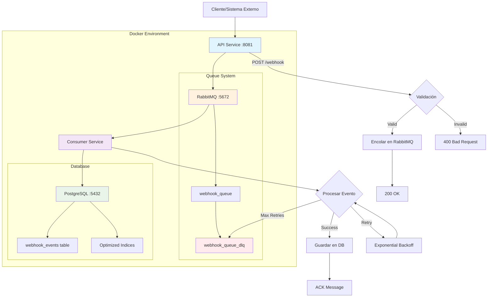

# Análisis del Sistema de Webhooks

## 1. Resumen Ejecutivo

Este proyecto implementa un sistema distribuido de procesamiento de webhooks basado en microservicios, diseñado para manejar 1 millón de eventos por día con alta disponibilidad y procesamiento asíncrono. El sistema utiliza Go, RabbitMQ y PostgreSQL como tecnologías core.

## 2. Arquitectura General

### 2.1 Estructura del Proyecto
```
webhook/
├── api_service/          # Servicio API REST (recepción de webhooks)
├── consumer_service/     # Servicio consumidor (procesamiento asíncrono)
├── database/            # Módulo de base de datos compartido
├── queue/               # Módulo de cola compartido (RabbitMQ)
├── docker-compose.yml   # Orquestación de servicios
└── plan.md             # Documentación de diseño
```

### 2.2 Servicios y Componentes

#### **API Service** (`api_service/`)
- **Propósito**: Recepción y validación de webhooks externos
- **Puerto**: 8081 (mapeado desde 8080 interno)
- **Framework**: Echo v4 (Go)
- **Responsabilidades**:
  - Validar payloads de webhooks
  - Encolar eventos en RabbitMQ
  - Retornar confirmación inmediata (200 OK)

#### **Consumer Service** (`consumer_service/`)
- **Propósito**: Procesamiento asíncrono de eventos
- **Responsabilidades**:
  - Consumir mensajes de RabbitMQ
  - Persistir eventos en PostgreSQL
  - Implementar retry logic con backoff exponencial
  - Manejo de Dead Letter Queue (DLQ)

#### **Database Module** (`database/`)
- **Tipo**: Módulo Go compartido
- **Base de datos**: PostgreSQL 17 Alpine
- **ORM**: SQL nativo con driver lib/pq
- **Migraciones**: Goose v3

#### **Queue Module** (`queue/`)
- **Tipo**: Módulo Go compartido
- **Broker**: RabbitMQ 3.13 con Management UI
- **Patrón**: Publisher-Consumer con acknowledgments manuales

## 3. Dependencias y Tecnologías

### 3.1 Stack Tecnológico
- **Lenguaje**: Go 1.24
- **Web Framework**: Echo v4.13.4
- **Message Broker**: RabbitMQ 3.13
- **Base de Datos**: PostgreSQL 17 Alpine
- **Migraciones**: Goose v3.24.3
- **Containerización**: Docker & Docker Compose
- **Testing**: Testify v1.10.0

### 3.2 Dependencias Clave
```go
// API Service
- github.com/labstack/echo/v4 v4.13.4
- github.com/joho/godotenv v1.5.1
- github.com/stretchr/testify v1.10.0

// Queue
- github.com/rabbitmq/amqp091-go v1.10.0

// Database
- github.com/lib/pq v1.10.9
- github.com/pressly/goose/v3 v3.24.3
- github.com/google/uuid v1.6.0
```

## 4. Modelos de Datos

### 4.1 Webhook Event (API)
```go
type WebhookEvent struct {
    ID        string                 `json:"id"`
    Source    string                 `json:"source"`
    Type      string                 `json:"type"`
    Data      map[string]interface{} `json:"data"`
    Timestamp time.Time              `json:"timestamp"`
}
```

### 4.2 Queue Message
```go
type Message struct {
    ID        string    `json:"id"`
    Content   string    `json:"content"`
    Timestamp time.Time `json:"timestamp"`
    Type      string    `json:"type"`
}
```

### 4.3 Database Schema
```sql
CREATE TABLE webhook_events (
    id UUID PRIMARY KEY DEFAULT gen_random_uuid(),
    event_id VARCHAR(255),
    source VARCHAR(255) NOT NULL,
    type VARCHAR(255) NOT NULL,
    data JSONB NOT NULL,
    timestamp TIMESTAMP WITH TIME ZONE NOT NULL DEFAULT NOW(),
    created_at TIMESTAMP WITH TIME ZONE NOT NULL DEFAULT NOW()
);
```

## 5. Integraciones y Servicios Externos

### 5.1 Infraestructura de Mensajería
- **RabbitMQ**: Puerto 5672 (AMQP), Puerto 15672 (Management UI)
- **Configuración**: TTL de mensajes 30 días, queues duraderas
- **Dead Letter Queue**: Implementada para manejo de fallos

### 5.2 Base de Datos
- **PostgreSQL**: Puerto 5432
- **Indices**: Optimizados para source, type, timestamp, created_at
- **Health Checks**: Implementados en Docker Compose

### 5.3 Configuración Externa
- **Variables de Entorno**: Configuración via .env
- **Health Checks**: Para servicios dependientes
- **Restart Policies**: unless-stopped para alta disponibilidad

## 6. Flujo de Datos del Sistema

### 6.1 Diagrama de Flujo Base
```
Cliente/Webhook → API Service → RabbitMQ → Consumer Service → PostgreSQL
     ↓              ↓             ↓            ↓              ↓
  POST /webhook   Validación   Encolado   Procesamiento   Persistencia
     ↓              ↓             ↓            ↓              ↓
   200 OK      Queue Message  Pub/Sub     DB Insert    Event Stored
                                              ↓
                                         [En caso de fallo]
                                              ↓
                                         Dead Letter Queue
```

### 6.2 Flujo Detallado
1. **Recepción**: Cliente envía webhook a `/webhook`
2. **Validación**: API valida campos requeridos (source, type)
3. **Encolado**: Mensaje se publica en RabbitMQ
4. **Confirmación**: API retorna 200 OK inmediatamente
5. **Consumo**: Consumer service obtiene mensaje de la cola
6. **Procesamiento**: Se procesa el evento con retry logic
7. **Persistencia**: Evento se guarda en PostgreSQL
8. **Acknowledgment**: Mensaje se marca como procesado
9. **DLQ**: Mensajes fallidos van a Dead Letter Queue

## 7. Diagrama Mermaid



## 8. Características de Diseño

### 8.1 Patrones Implementados
- **Asynchronous Processing**: Desacoplamiento entre recepción y procesamiento
- **Retry Pattern**: Backoff exponencial con máximo 3 intentos
- **Dead Letter Queue**: Manejo de mensajes fallidos
- **Circuit Breaker**: Health checks en dependencias
- **Publisher-Subscriber**: RabbitMQ como message broker

### 8.2 Características de Confiabilidad
- **At-least-once delivery**: Acknowledgments manuales
- **Message persistence**: Queues duraderas
- **Graceful shutdown**: Manejo de señales del sistema
- **Exponential backoff**: 1s, 2s, 4s entre reintentos
- **Data durability**: TTL de 30 días para mensajes

### 8.3 Escalabilidad
- **Horizontal scaling**: Múltiples instancias de consumer
- **Queue-based architecture**: Manejo de picos de tráfico
- **Connection pooling**: Conexiones reutilizables
- **Indexed database**: Optimizado para consultas frecuentes

## 9. Estado de Implementación

### 9.1 Completado ✅
- API endpoint funcional con Echo
- RabbitMQ configurado en Docker
- PostgreSQL con migraciones
- Consumer service con retry logic
- Dead Letter Queue implementada
- Docker Compose orchestration
- Health checks configurados

### 9.2 Pendiente ⏳
- Soporte para Amazon SQS (Fase 2)
- Timeout en requests API
- Métricas y monitoring
- Tests de integración
- Documentación de API (OpenAPI/Swagger)

## 10. Recomendaciones

### 10.1 Mejoras a Corto Plazo
1. **Monitoring**: Implementar métricas con Prometheus/Grafana
2. **Logging**: Structured logging con correlación de requests
3. **API Documentation**: Swagger/OpenAPI specs
4. **Load Testing**: Validar capacidad de 1M eventos/día

### 10.2 Mejoras a Largo Plazo
1. **Multi-Queue Support**: Implementar interface para SQS
2. **Event Sourcing**: Considerar CQRS para escalabilidad
3. **Kubernetes**: Migración desde Docker Compose
4. **Observability**: Tracing distribuido con Jaeger/OpenTelemetry

Este sistema presenta una arquitectura sólida y bien estructurada para el procesamiento de webhooks a escala, con patrones de diseño apropiados para alta disponibilidad y confiabilidad.