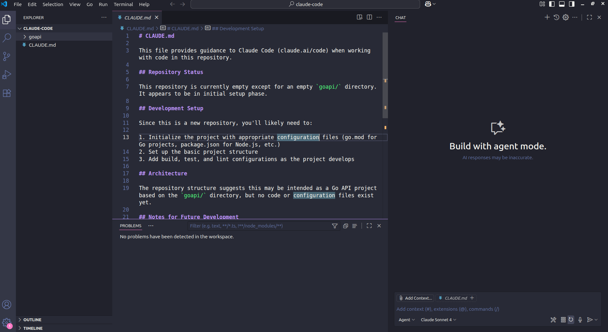

# Claude tutorial, tips

- Intriduccion, de copilot a claude code 
- Historia,  definicion de claude
- Otras herramientas similares
- Instalacion,  setup.
- Repositorio para seguir tutorai,  descarga
- Init claude command 
- Explain project prompt
- Add a feature  
- Fix a bug
- Use @ to change specific files 
- Tools description
- Web tool documentation
- Copy image from clipboard
- Use commands 
- Use subagents.
- Use MCP - playwright
- use memory

Claude code desde hace unos meses se convirtio en mi herramienta favorita de AI para el desarrollo, como previo usuario de Github Copilot y eventual de Cursor note estas 
Si bien copilot funciona excelente y todavia lo utlizo en algunas ocasiones,  note  diferencias en particular que me llevaron a utilizar mas claude code:

Claude Code es una agente de IA que se ejecuta desde la terminal que permite entre otras cosas investigar proyecto, agregar funcionalidades, arreglar bugs, etc.
salio en preview en febrero de 2025 y en Mayo estuvo disponible para todos los usuarios,  

- Ejecucion en terminal,  en mi caso al utilizar constantemente la terminal se convierte en algo mas natural

- Separacion de la interfaz de AI por fuera del editor,  algo que no me convence con respecto a la integracion de IA en los editores es  que se vuelve un poco complejo la UX al tener muchos paneles al mismo tiempo y se pierde foco en el editor de codigo. 

- Agnostico e independiente de editores,  aunque en caso de requerirlo Claude Code se puede integrar con editores como VSCode, Cursor.

