# Claude tutorial, tips

## Tabla de contenidos

- [Introducción, definición](#introducción-definición)
- [Instalación](#instalación)
- [Init claude command](#init-claude-command)
- [Explicación, análisis del proyecto](#explicación-análisis-del-proyecto)
- [Implementar feature, tarea](#implementar-feature-tarea)
- [Revisar cambios](#revisar-cambios)
- [Use de @ para archivos](#use-de--para-archivos)
- [Fix BUG](#fix-bug)
- [Modo plan](#modo-plan)
- [Modo Thinking](#modo-thinking)
- [Claude Code Tools](#claude-code-tools)
- [Agregar imágenes al contexto](#agregar-imágenes-al-contexto)
- [Uso de comandos](#uso-de-comandos)
- [Retomar conversación](#retomar-conversación)
- [Uso de sub-agentes](#uso-de-sub-agentes)
- **Usar MCP - Playwright** - **No implementado aún**
- **Usar memoria** - **No implementado aún**
- Estilo de agente - **No implementado aún**

# Introducción, definición

Claude Code desde hace unos meses se convirtió en mi herramienta favorita de IA para tareas relacionadas con la tecnología, como previo usuario de GitHub Copilot y eventual de Cursor noté estas. Si bien Copilot funciona excelente y todavía lo utilizo en algunas ocasiones, noté diferencias en particular que me llevaron a utilizar más Claude Code:

Claude Code es un agente de IA que se ejecuta desde la terminal que permite entre otras cosas investigar proyecto, agregar funcionalidades, arreglar bugs, etc. Salió en preview en febrero de 2025 y en Mayo estuvo disponible para todos los usuarios.

En los últimos meses otras empresas como Google y OpenAI sacaron herramientas similares:

- [Gemini CLI](https://blog.google/technology/developers/introducing-gemini-cli-open-source-ai-agent/)
- [OpenAI Codex CLI](https://help.openai.com/en/articles/11096431-openai-codex-cli-getting-started)

### Ventajas de Claude Code

- **Ejecución en terminal**: en mi caso al utilizar constantemente la terminal se convierte en algo más natural

- **Separación de la interfaz de IA por fuera del editor**: algo que no me gusta mucho con respecto a la integración de IA en los editores es que se vuelve un poco complejo la UX al tener muchos paneles al mismo tiempo y se pierde foco en el editor de código.


- **Agnóstico e independiente de editores**: aunque en caso de requerirlo Claude Code se puede integrar con editores como VS Code, Cursor.

# Instalación

### Requerimientos

Al momento se requiere tener una suscripción a Anthropic para utilizar Claude Code:

- **Pro**: Permite utilizar el modelo Claude Code 4, el cual es excelente para las tareas diarias de desarrollo.
- **Max**: Permite utilizar el modelo Claude Opus, el cual es el modelo más avanzado de Anthropic el cual está preparado para tareas más complejas.

O utilizar una API key, en este caso se va a pagar por uso, el cual se puede incrementar rápidamente dependiendo del tipo de tarea, no olviden que al ser un agente de IA, cada pregunta, consulta puede generar múltiples consultas a la API de Anthropic.

**NodeJS**: 18 o superior

### Instalación de Claude Code

```bash
npm install -g @anthropic-ai/claude-code
```

Los ejemplos de este tutorial están realizados con el modelo Pro.

**Otros requerimientos**:
- Docker 


# Init claude command

Lo primero que se debe hacer es ejecutar el comando claude dentro del repositorio o del proyecto que deseen utilizar.

Acepten los permisos para que Claude pueda modificar los archivos del proyecto.

El primer comando a ejecutar es el siguiente:

```bash
/init 
```

Este comando va a inicializar el agente, el cual va a analizar el proyecto actual, estructura, archivos, dependencias, etc y va a generar un archivo de configuración llamado `CLAUDE.md` en la raíz del proyecto con la documentación del proyecto, la utilidad de este archivo es para que Claude envíe estas instrucciones cada vez que se inicie una nueva conversación y pueda tener "memoria" de las prácticas y estructura del proyecto.

### Tipos de archivos CLAUDE.md

Hay tres tipos de archivos CLAUDE.md que se pueden generar:

1. **Por proyecto**: el cual se va a subir al repositorio.
2. **Para uso local**: con reglas especificas del proyecto, el cual no se va a subir al repositorio.
3. **Para uso general**: en todos los proyectos en los que se utilize Claude Code.

En nuestro caso vamos a utilizar la opción 1.


## Explicación, análisis del proyecto
Uno de los usos más efectivos de Claude Code es el análisis, explicación de un proyecto, esto puede ser útil en alguno de estos casos:

- Cuando nos incorporamos a un proyecto nuevo que ya tiene un tiempo considerable de desarrollo.
- Para entender un feature.
- Para revisión de un pull request.

Para esto podríamos usar un prompt como el siguiente:

```bash
Haz un análisis del proyecto, código, estructura, dependencias, integraciones, etc.
Genera un diagrama de flujo base y también en formato mermaid, guarda el contenido en un archivo llamado RESEARCH.md
```

Acá vemos a Claude Code en acción, generando un TODO list y utilizando diferentes tools para investigar el proyecto.

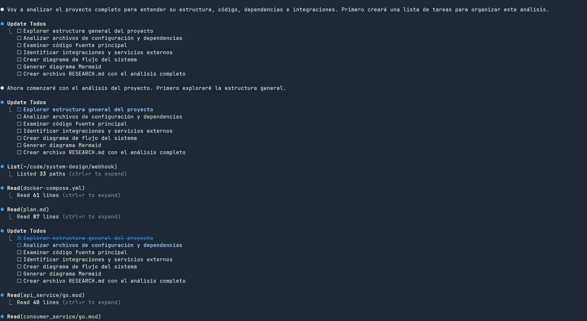

Resultado generado:

- [RESEARCH.md](RESEARCH.md)


# Implementar feature, tarea

A la hora de implementar una tarea, lo recomendable es ser lo más específico posible en el prompt, esto es importante ya que de otra manera Claude Code va a inferir, suponer y puede darse que el resultado esté lejos de lo que se espera, como toda herramienta si se utiliza de manera incorrecta puede generar más trabajo que beneficio.

Tomemos como ejemplo que tenemos una API backend en el cual queremos agregar una conexión a una base de datos MySQL.

### Ejemplo de un mal prompt

```bash
Agrega una base de datos MySQL a la API.
```

Si bien esto puede dar un resultado funcional, lo que va a suceder es que Claude Code va a tomar decisiones que tal vez no sean las esperadas, como utilizar una librería que no queremos, hacer algo más complejo de lo necesario, etc.

### Un mejor prompt sería

```bash
Quiero agregar a la API existente una conexión a la base de datos MySQL.

- Agregar servicio MySQL en docker compose, utiliza la versión 8.
- Utiliza la librería "goose" para las migraciones de la base de datos.
- Utiliza la librería GORM para la conexión a la base de datos.
- Crea una tabla llamada "posts" en un archivo de migración con los siguientes campos: id, title, content
- Todos los archivos asociados a la base de datos deben estar en una carpeta llamada "db" 
```

Al detallar en específico las versiones, librerías, rutas se puede generar un resultado más acorde a lo que se espera, así que siempre es recomendable tomarse unos minutos para pensar el detalle del prompt.

## Revisar cambios

A medida que Claude Code va generando cambios en el proyecto, nos da la posibilidad de configurar el "auto-accept" ya sea seleccionando esa opción cuando Claude Code necesite editar un archivo o ejecutando el comando o presionando dos veces shift+tab 1 vez.

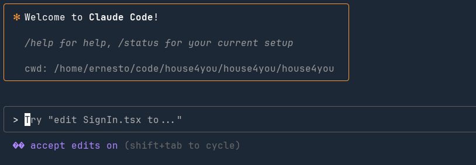

Si bien esta opción puede ser útil en ciertas circunstancias, como por ejemplo veremos más adelante utilizando el agente en background, lo recomendable es ir revisando los cambios línea por línea, para asegurarnos de que todo esté correcto e ir ajustando, indicando a Claude que queremos cambiar, de manera similar a lo que haríamos en un code review.

Recordar que los LLM son no determinísticos, es decir que pueden generar diferentes resultados para el mismo prompt, además de que nosotros vamos a ser los responsables si el código se sube a producción y tiene errores o bugs.


# Uso de @ para archivos.

Si bien Claude Code tiene la capacidad de entender el contexto del proyecto y buscar el archivo en que se debe aplicar un cambio, podemos ser más específicos y decirle a Claude cuál es el archivo específico que necesitamos editar, esto va a permitir que Claude sea más rápido y no malgastar tokens utilizando las tools.

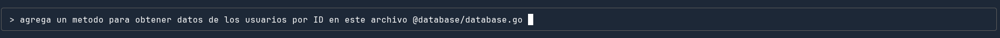


# Fix BUG
Generalmente cuando tenemos un bug y acceso al texto de este en particular, copiar el mensaje en Claude puede ser suficiente.

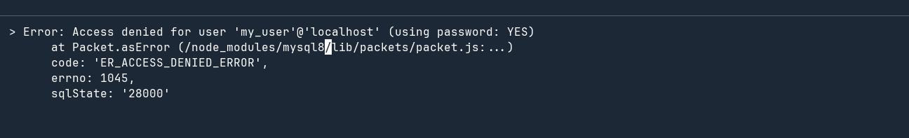

Aquí puede sumar comentar qué fue lo que intentamos previamente hacer para solucionar el bug, agregar archivos, contexto, etc.


# Modo plan
Claude tiene un modo plan, el cual se puede habilitar presionando shift+tab 2 veces.

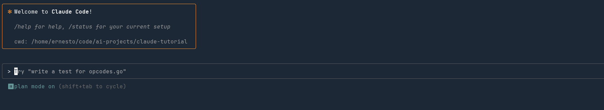

Este modo es útil para tareas medianas/complejas, ya que permite que Claude pueda planificar los pasos a seguir de una manera estructurada, iterando y validando cada paso.

Por ejemplo.

```bash
Integrate our existing Golang API with AWS services: S3 for file uploads and SQS for async task processing
```

Ejemplo de resultado:

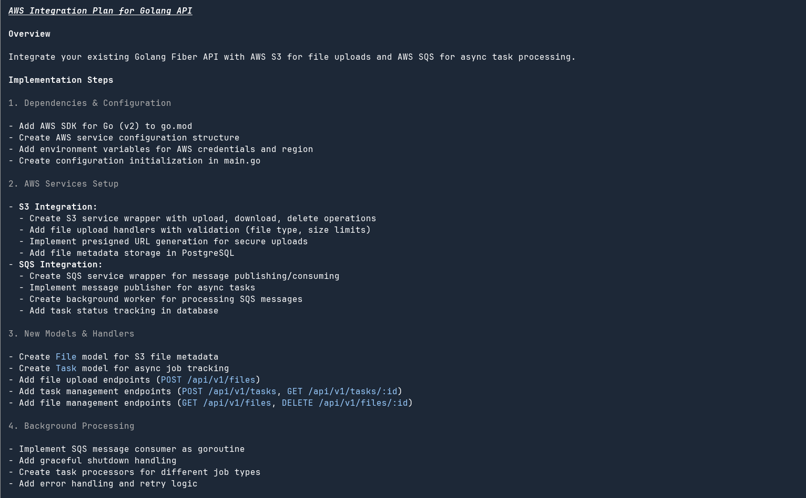

Después de esto podemos aceptar el plan o seguir ajustando el plan.


# Modo Thinking

En ciertas ocasiones sucede que Claude no puede resolver o encontrar la solución a una tarea, debido a su complejidad, para esto podemos activar desde el prompt el modo thinking, esto se hace de la siguiente manera:

Por ejemplo usando este prompt:

```bash
In Go, my app sometimes hangs, sometimes crashes with concurrent map read and map write, and sometimes gives wrong results under high concurrency. Why does this happen and how can I
  debug it?",  please think
```

Resultado:
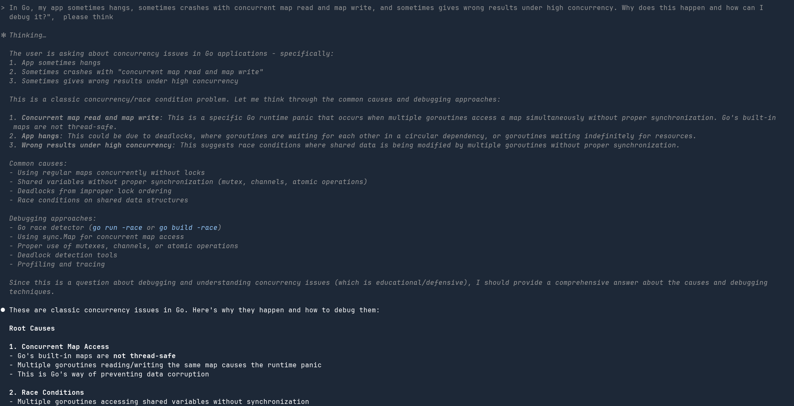

Esto nos puede llegar a dar un mejor resultado, aunque tengan en cuenta que en este modo, se hace un uso mayor de tokens y en consecuencia es más costoso.


# Claude Code Tools

Los agentes de IA como Claude Code, Copilot, Cursor, etc tienen la capacidad de utilizar herramientas para realizar tareas específicas en vías de solucionar un problema.

En el caso de Claude Code, algunas de las tools disponibles al momento son:

### Herramientas de Archivos y Proyecto

- **Read**: Leer archivos del proyecto
- **Write**: Crear nuevos archivos o en caso de ser necesario editar
- **Edit/MultiEdit**: Modificar archivos existentes con operaciones precisas de buscar y reemplazar

### Herramientas de Búsqueda

- **Glob**: Buscar patrones de archivos (ej: `**/*.ts`, `src/**/*.tsx`)
- **Grep**: Búsqueda basada en el comando grep
- **LS**: Listar contenidos de directorios

### Herramientas de Sistema

- **Bash**: Ejecutar comandos de shell con comillas adecuadas y soporte de ejecución en segundo plano

### Herramientas Web

- **WebFetch**: Recuperar y analizar contenido web
- **WebSearch**: Buscar en la web información actual


# Agregar imágenes al contexto.

Para agregar imágenes a la conversación, se debe copiar el path de la imagen ( 
ejemplo Ubuntu, click derecho sobre la imagen y seleccionar "copiar") y posteriormente pegar con ctrl+shift+v en la terminal.

Esto nos puede servir tanto para analizar diagramas, diseños, errores, etc.

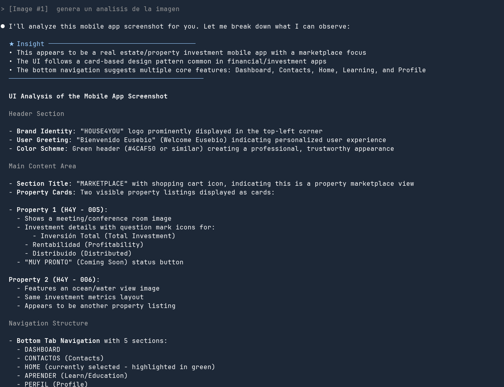


# Uso de comandos

Algo que puede suceder es que en algún momento nos encontremos repitiendo una y otra vez el mismo prompt o tarea, ya sea para explicar un proyecto, actualizar, revisión, etc.
Para evitar esto podemos crear archivos en formato Markdown en la carpeta `.claude/commands` 

Por ejemplo veamos un comando para hacer un review de seguridad.

security-audit.md
```markdown
Perform a security audit on this code. Look for:
- SQL injection vulnerabilities
- XSS risks
- Authentication/authorization issues
- Sensitive data exposure
- Input validation problems
```

Otro ejemplo de comando para actualizar el archivo README.md con los últimos cambios.

update-readme.md
```markdown
Actualiza README.md con los cambios recientes:

- Analiza archivos modificados y detecta: nuevas features, dependencias, configuraciones, estructura
- Actualiza secciones afectadas: Features, Installation, Usage, Configuration, API docs
- Añade/actualiza Changelog con formato: ### Added/Changed/Fixed/Removed
- Mantén formato e idioma existente, no elimines contenido válido
- Lista los cambios propuestos antes de aplicarlos
```

Estos comandos se utilizan desde Claude Code de la siguiente manera:

```bash
/security-audit
```


```bash
/update-readme
```


# Retomar conversación.

Si necesitamos retomar una conversación previa, debido a que no terminamos una tarea que no terminamos o presionamos ctrl+c por error, podemos utilizar el comando:

```bash
/resume
```

esto nos va a mostrar un listado con las últimas conversaciones, seleccionamos la que queremos retomar y podemos proseguir.

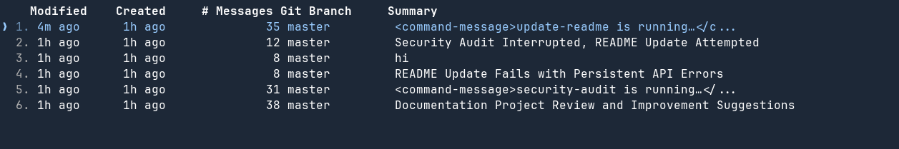


# Uso de sub-agentes
Claude nos permite poder crear sub-agentes, para realizar diversas tareas, esto puede resultar algo similar a lo que vimos anteriormente con los comandos, pero hacerlo de esta manera tiene algunas diferencias:

- El agente tiene su propia ventana de contexto, o sea no comparte el contexto con Claude como pasa con los comandos. 
- Tiene su propio prompt de sistema
- Se pueden habilitar o deshabilitar diferentes tools.

Para crear un sub-agente,  se utiliza el comando:

```bash
/agent
```
Create new agent

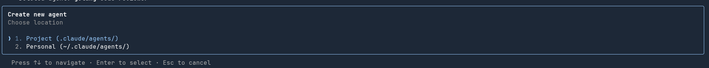

Aquí podemos generar un agente específicamente para el proyecto desde el que estemos ejecutando Claude o a nivel general del sistema.

En la opción siguiente seleccionamos la opción.

1. Generate with Claude (recommended)

En la siguiente sección tenemos que definir el rol del agente.

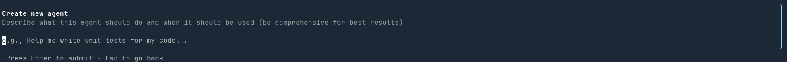

En este caso vamos a crear un agente para que genere un code-review del código.

Ejemplo

```markdown
You are a senior Golang specialist performing a comprehensive code review. Analyze this Go code with focus on:

GOLANG BEST PRACTICES:
- Idiomatic Go patterns and conventions
- Effective use of goroutines and channels
- Proper error handling (not just if err != nil)
- Context usage and cancellation
- Defer statements placement and usage

PERFORMANCE & MEMORY:
- Memory allocations and potential leaks
- Goroutine leaks
- Efficient use of slices vs arrays
- String concatenation optimization
- Sync.Pool usage where appropriate
- Benchmark-worthy code sections

CONCURRENCY SAFETY:
- Race conditions
- Proper mutex usage (sync.Mutex vs sync.RWMutex)
- Channel deadlocks
- WaitGroup patterns
- Atomic operations where needed

CODE STRUCTURE:
- Interface design and composition
- Package organization and naming
- Exported vs unexported identifiers
- Embedded types usage
- Method receivers (pointer vs value)

TESTING & RELIABILITY:
- Table-driven test completeness
- Benchmark tests for critical paths
- Race detector compatibility
- Mock interfaces design
- Test coverage gaps

SECURITY:
- SQL injection in database/sql usage
- Command injection in os/exec
- Path traversal vulnerabilities
- Proper crypto package usage
- Sensitive data in logs

Provide specific line-by-line feedback with severity levels (Critical/Major/Minor) and code examples for improvements. Focus on Go-specific issues that linters might miss.
``` 

Podemos seleccionar las tools que queremos habilitar, en este caso vamos a dejar todo habilitado como viene por defecto.

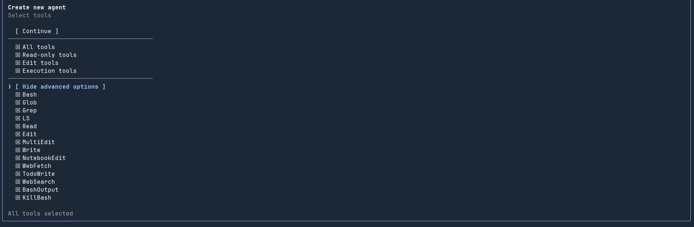

Si vemos el contenido de nuestro proyecto, podemos observar que Claude generó un nuevo archivo en la carpeta `.claude/agents` con el nombre golang-code-reviewer.

Podemos invocar el agente de la siguiente manera:

```bash
use golang-code-reviewer
```

Resultado 

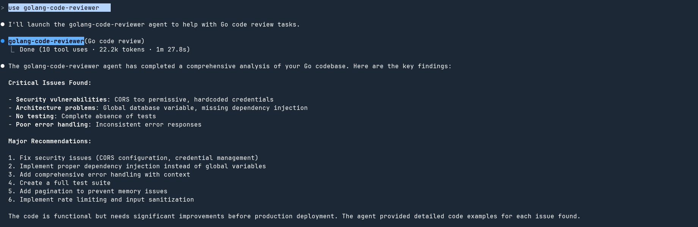


# Uso de MCP - Playwright
En Claude Code podemos configurar diferentes servicios MCP para poder aumentar las capacidades del agente, uno de los más conocidos es Playwright el cual nos permite interactuar con un navegador web para realizar diversas acciones, como testing automático.

https://github.com/microsoft/playwright-mcp 

Instalación

```bash
claude mcp add playwright npx @playwright/mcp@latest
```

Una vez instalado, podemos verificar que Playwright esté disponible ejecutando este comando:

```bash
/mcp 
```

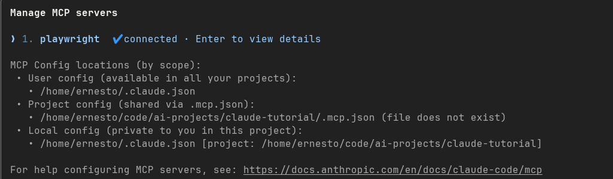

Ejemplo de uso:

Podemos indicar el siguiente prompt para ejecutar Playwright en algún sitio web:

```bash
open this url using playwright http://localhost:8000/ and try to login using username "admin" and password "password" if there is and error take and screenshot
```

Aquí vemos a Playwright en acción abriendo un navegador

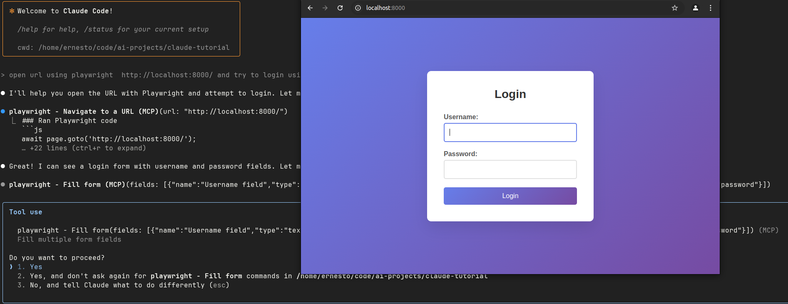

En caso de que no pueda loguearse por algún motivo, va a tomar un screenshot y lo va a guardar en la carpeta playwright-mcp:

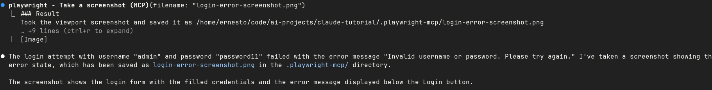


